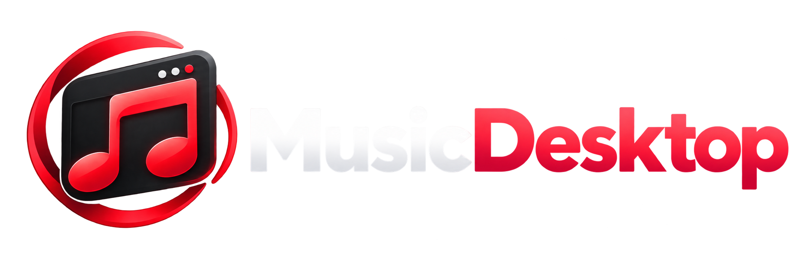

# Music Desktop

[Version française](../fr/README.md)

## YouTube Music, in its own place.

**Music Desktop** is a Windows application dedicated to YouTube Music. It is for anyone who simply wants to listen without leaving a full browser open just for a music tab.

Your music keeps its own window, separate from browsing, searches, and everything else you do.

## Why Music Desktop?

- A dedicated YouTube Music window, without a browser tab to keep open.
- A mini player that stays accessible above other windows.
- Simple controls so your music is still within reach while you work, play, or chat.
- Optional Discord integration to show the track you are listening to.

Music Desktop does not try to transform YouTube Music. Its purpose is simply to give it a more natural place on Windows, in an application made for music.

## Keep your RAM for what matters

Music Desktop uses WebView2 to display YouTube Music. Memory usage therefore depends on the page, playback, and your computer; it is not limited to a few megabytes. The benefit is having a dedicated app instead of keeping a music tab open in your usual browser.

## Download

➡️ **[Download the latest version of Music Desktop](https://github.com/Azashiin/Music-Desktop-Releases/releases/latest)**

The installer is available for 64-bit Windows from each release page. The same file serves both English and French: choose your language during installation, then change it at any time in Settings.

After installing version 1.2.5, later versions can be checked and installed directly from Music Desktop settings.

If you are still using version 1.2.4, install version 1.2.5 once from GitHub. Updates will work normally after that.

See the [release notes](CHANGELOG.md) for every version’s improvements.

## About

Music Desktop is an independent application. It is not affiliated with or endorsed by YouTube, Google, or Discord. Your YouTube Music sign-in remains managed by Google.

This repository exists only to distribute Music Desktop releases. No application source code is published here.
