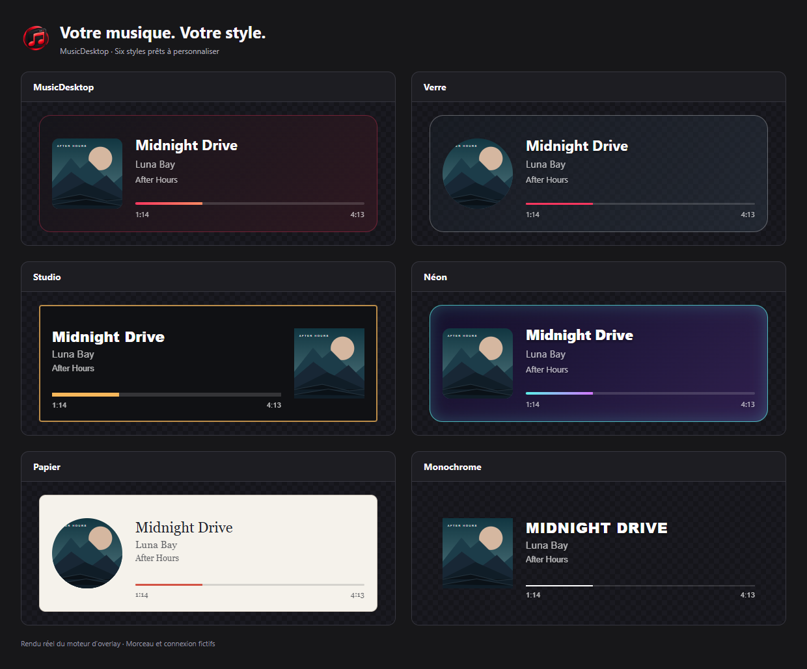

# Music Desktop

[Version française](../fr/README.md)

## YouTube Music, in its own place.

**Music Desktop** is a Windows application dedicated to YouTube Music. It is for anyone who simply wants to listen without leaving a full browser open just for a music tab.

Your music keeps its own window, separate from browsing, searches, and everything else you do.

## Why Music Desktop?

- A dedicated YouTube Music window, without a browser tab to keep open.
- A mini player that stays accessible above other windows.
- Simple controls so your music is still within reach while you work, play, or chat.
- Optional Discord integration to show the track you are listening to.
- Pairing with MusicDesktop Remote to control playback from your phone.

Music Desktop does not try to transform YouTube Music. Its purpose is simply to give it a more natural place on Windows, in an application made for music.

## MusicDesktop Remote

Pair your phone with the PC from MusicDesktop settings. You can then control playback, search for tracks and browse the queue remotely. Music keeps playing on the PC.

## Streamer Studio

MusicDesktop 2.0.3 lets you add a track overlay to OBS or Streamlabs. Six layouts
and six editable styles let you choose the background, artwork, text and
progress. The dashboard provides a preview, controls and guide; save your
changes to apply them to OBS.

Control playback with the [MusicDesktop Deckboard extension](https://github.com/Azashiin/MusicDesktop-Deckboard)
or the Elgato Stream Deck plugin, available under **Streamer Dashboard → Controls**.
Audio capture is configured separately in your streaming software.

## New in 2.0.5

- Lyrics on Remote with YouTube Music and LRCLIB; an optional **experimental**
  local engine for lyrics without sync timings.
- Queue reordering and playlist management for the YouTube Music account
  connected on your PC, with **Remote 1.0.5 or a compatible version**.
- Last.fm connection and listening history after explicit opt-in.
- Three themes: MusicDesktop, Akyraïs and Asashiin.
- Detailed update downloads, followed by a restart when you choose.
- Streamer starts OFF, with an ON/OFF switch in the app’s top bar.

Download the lyrics engine separately; audio capture requires Windows 11 and
timing accuracy varies by track. Remote remains in Android closed testing:
[join the test](https://musicdesktop.net/en/remote.html).

## Download

➡️ **[Download the latest version of Music Desktop](https://github.com/Azashiin/Music-Desktop-Releases/releases/latest)**

The installer is available for 64-bit Windows from each release page. The same file serves both English and French: choose your language during installation, then change it at any time in Settings.

New versions can be checked and installed from MusicDesktop settings.

See the [release notes](CHANGELOG.md) for every version’s improvements.

## About

Music Desktop is an independent application. It is not affiliated with or endorsed by YouTube, Google, or Discord. Your YouTube Music sign-in remains managed by Google.

This repository exists only to distribute Music Desktop releases. No application source code is published here.
